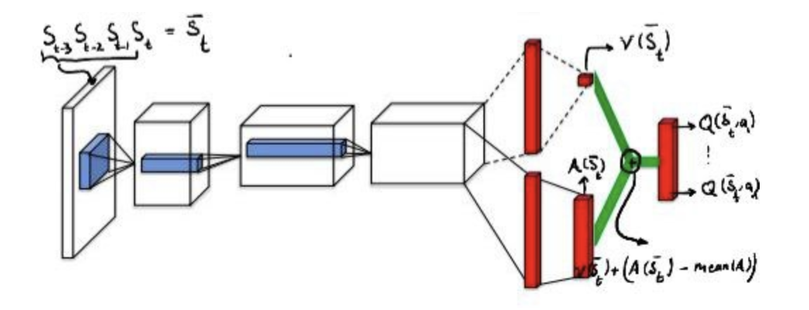
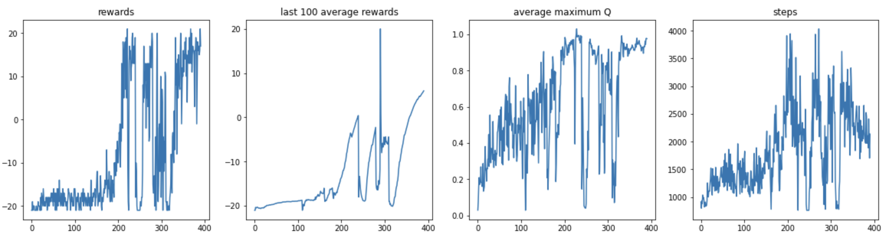

# DDQN-Implementation

In this repository, I implemented and trained a DDQN model and run it on an Atari game (PongDeterministic-v4) in **OpenAI-Gym** environment.

## Q network architecture

<h3 align="center">
  
</h3>

## DDQN algorithm

Q1 = online Q network
Q2 = target Q network

For each step:
1. Choose action a ϵ-greedy(Q1)
2. s = env.step(a)
3. store into replay buffer
4. train Q1 and Q2 networks with algorithm B(Q1, Q2, replay_buffer)
5. Q2 ← Q1

**Algorithm B. train**
1. take samples (s, a, r, ns, done) from replay_buffer
2. train Q1 with loss function: 

$$ ℒ(Q1(s, a), r + γ * Q2(ns, argmax Q1(ns, a')))$$

where

$$ ℒ(x, y) = (x-y)^{2}$$

## test time result

https://user-images.githubusercontent.com/79265364/221958997-d55b0da8-52d1-4672-8c2a-587f0beac600.mp4

## training results

<h3 align="center">
  
</h3>

